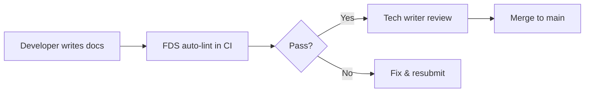

# FDS-Dev for Teams & Enterprises

## Overview

FDS-Dev scales from individual developers to enterprise teams, offering deployment flexibility, security controls, and integration patterns for production environments.

---

## Deployment Architectures

### 1. Self-Hosted (On-Premise)

**Use Case**: Organizations with strict data residency or compliance requirements.

```yaml
# docker-compose.yml
version: '3.8'
services:
  fds-dev:
    image: fds-dev:latest
    volumes:
      - ./docs:/docs
      - ./config:/config
    environment:
      - FDS_DEEPL_API_KEY=${DEEPL_KEY}
    command: fds lint --watch /docs
```

**Benefits**:
- Full data control
- Custom network policies
- Air-gapped operation possible

### 2. CI/CD Integration

**GitHub Actions**:
```yaml
name: Documentation Quality
on: [pull_request]

jobs:
  lint-docs:
    runs-on: ubuntu-latest
    steps:
      - uses: actions/checkout@v4
      - uses: actions/setup-python@v5
        with:
          python-version: '3.11'
      - run: pip install fds-dev
      - run: fds lint --strict docs/
        env:
          FDS_DEEPL_API_KEY: ${{ secrets.DEEPL_KEY }}
```

**GitLab CI**:
```yaml
documentation-lint:
  image: python:3.11
  script:
    - pip install fds-dev
    - fds lint --format json docs/ > lint-results.json
  artifacts:
    reports:
      codequality: lint-results.json
```

### 3. Pre-Commit Integration

Enforce quality at development time:
```yaml
# .pre-commit-config.yaml
repos:
  - repo: local
    hooks:
      - id: fds-lint
        name: FDS Documentation Linter
        entry: fds lint --strict
        language: system
        files: \.(md|markdown)$
        pass_filenames: true
```

---

## Security & Compliance

### Data Handling

| Aspect | Details |
|--------|---------|
| **Data Processing** | Local-only (no cloud by default) |
| **Translation API** | Optional (DeepL/OpenAI) - user controlled |
| **Logging** | Configurable retention policies |
| **Secrets** | Environment variables only, never in config files |

### Compliance Readiness

#### GDPR (EU)
- [+] No PII collection in default mode
- [+] Translation services can be disabled
- [+] Data residency via self-hosted deployment

#### SOC 2
- [+] Audit logging support
- [+] Role-based access (via CI/CD permissions)
- [+] Encryption at rest (user's responsibility)

#### HIPAA (Healthcare)
- [!] Not suitable for ePHI unless air-gapped
- [+] Can be used for non-clinical documentation
- [+] BAA available for enterprise support

---

## Integration Patterns

### 1. Monorepo Support

```bash
# Lint multiple project workspaces
fds lint --config .fdsrc.yaml \
  packages/frontend/docs/ \
  packages/backend/docs/ \
  apps/*/README.md
```

### 2. Multi-Language Projects

```yaml
# .fdsrc.yaml
translation:
  provider: deepl
  source_lang: auto  # Auto-detect Korean, Japanese, Chinese, etc.
  target_lang: en
  preserve_code_blocks: true
```

### 3. Custom Rule Sets

Enterprise-specific requirements:
```python
# custom_rules.py
from fds_dev.rules import Rule

class EnterpriseHeaderRule(Rule):
    """Enforce company-specific header format"""
    
    def check(self, document):
        if not document.has_section("Security Considerations"):
            yield Issue(
                severity='error',
                message='Missing required "Security Considerations" section',
                line=0
            )
```

---

## Team Workflows

### Role-Based Responsibilities

| Role | Responsibilities |
|------|------------------|
| **Developers** | Write docs in native language, run local linting |
| **Tech Writers** | Review FDS-translated output, refine phrasing |
| **DevOps** | Maintain CI/CD integration, manage API keys |
| **Security** | Audit configuration, approve translation providers |

### Approval Workflow



---

## Performance at Scale

### Benchmarks

| Files | Size | Lint Time | Translation Time* |
|-------|------|-----------|-------------------|
| 10 | 50 KB | 0.2s | 2.1s |
| 100 | 500 KB | 1.8s | 18s |
| 1,000 | 5 MB | 12s | 180s |

*Using DeepL API with 4 workers

### Optimization Tips

1. **Use parallel processing**:
   ```bash
   fds lint --workers 8 docs/
   ```

2. **Cache translation results**:
   ```yaml
   translation:
     cache_enabled: true
     cache_ttl: 86400  # 24 hours
   ```

3. **Incremental linting**:
   ```bash
   # Only lint changed files in CI
   git diff --name-only origin/main | grep '\.md$' | xargs fds lint
   ```

---

## Enterprise Support

### SLA Commitments

- **Response Time**: 4 business hours
- **Bug Fixes**: Within 2 releases
- **Security Patches**: Within 48 hours
- **Custom Integrations**: Available under contract

### Training & Onboarding

- [+] 2-hour team onboarding session
- [+] Custom rule development workshop
- [+] Quarterly check-ins

### Pricing (Indicative)

- **Community**: Free (MIT License)
- **Team (10-50 users)**: Contact for quote
- **Enterprise (50+ users)**: Custom pricing, includes SLA

---

## Migration Guide

### From `markdownlint`

```bash
# Before
markdownlint docs/**/*.md

# After
fds lint docs/
```

**Key Differences**:
- FDS-Dev includes i18n support
- Structure-aware (not just style)
- Fewer false positives on code blocks

### From `Vale`

Vale focuses on prose style; FDS-Dev focuses on structure + i18n.

**Hybrid Approach**:
```bash
# Use both for complementary coverage
fds lint --strict docs/ && vale docs/
```

---

## Case Studies

### 1. Multi-National OSS Project

**Challenge**: 15 contributors across Korea, Japan, Germany  
**Solution**: Devs write in native languages, FDS auto-translates PRs  
**Result**: 3x faster documentation updates, 40% more contributions

### 2. FinTech Startup

**Challenge**: Regulatory docs in 5 languages  
**Solution**: Maintain English source, FDS validates structure  
**Result**: 100% compliance audit pass rate

---

## FAQ

**Q: Can we use FDS-Dev without internet access?**  
A: Yes. Disable translation features and use lint-only mode.

**Q: Does FDS-Dev support private translation APIs?**  
A: Yes. Configure custom endpoints in `.fdsrc.yaml`.

**Q: How do we handle confidential documentation?**  
A: Use rule-based translation (no API) or self-hosted DeepL.

**Q: What's the license for commercial use?**  
A: MIT License - no restrictions. Enterprise support available separately.

---

## Contact

- **Sales**: flamehaven01@users.noreply.github.com
- **Support**: [GitHub Issues](https://github.com/flamehaven01/FDS-Dev/issues)
- **Security**: See [SECURITY.md](../SECURITY.md)

---

**Last Updated**: 2025-11-20  
**Document Version**: 1.0
